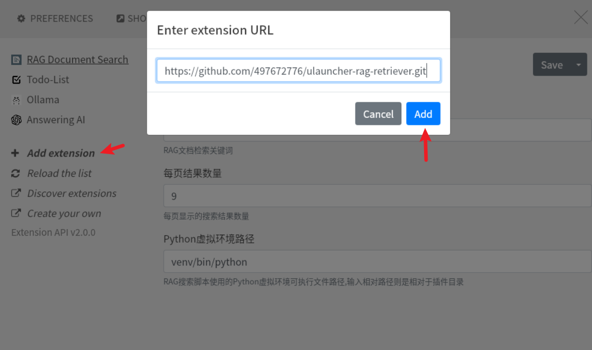

# RAG文档检索插件

基于向量和关键词的智能文档检索Ulauncher插件。

## 功能特点

- 🔍 **混合检索**: 结合向量语义搜索和BM25关键词匹配
- 📄 **多格式支持**: TXT, MD, PDF, DOCX, DOC文档
- ⚡ **快速响应**: 轻量级设计，即时搜索反馈
- 📊 **智能排序**: 相关度评分和来源标识

## 前置要求

1. **RAG Builder Service**: 必须先安装并运行后台服务
2. **Ollama**: 需要运行Ollama和bge-m3嵌入模型
3. **Python依赖**: 见requirements.txt

## 安装步骤

### 第一步：添加插件到Ulauncher

在Ulauncher插件界面中，点击"Add extension"，输入以下URL：

```
https://github.com/497672776/ulauncher-rag-retriever.git
```



### 方式一：自动安装脚本（推荐）

```bash
cd ~/.local/share/ulauncher/extensions/com.github.497672776.ulauncher-rag-retriever
chmod +x setup.sh
./setup.sh 你的用户名
```

例如：
```bash
./setup.sh liudecheng
```

脚本会自动完成虚拟环境安装、依赖安装、服务配置和启动。

### 方式二：手动安装

1. 安装虚拟环境和依赖
```bash
cd ~/.local/share/ulauncher/extensions/com.github.497672776.ulauncher-rag-retriever
python3 -m venv venv
source venv/bin/activate
pip install -r requirements.txt
```

2. 配置后台服务
   - 修改systemd服务路径：将用户名改为你自己的用户名
   ```ini
   # 在 rag-systemd/rag.service 文件中修改
   ExecStart=/home/你的用户名/.local/share/ulauncher/extensions/com.github.497672776.ulauncher-rag-retriever/rag-systemd/start_service.sh
   WorkingDirectory=/home/你的用户名/.local/share/ulauncher/extensions/com.github.497672776.ulauncher-rag-retriever/rag-systemd
   ```

3. 启动后台服务
```bash
cd rag-systemd
sudo cp rag.service /etc/systemd/system/
sudo systemctl daemon-reload
sudo systemctl restart rag
sudo systemctl enable rag
```

4. 测试后台服务
   - 数据库路径: `~/.local/share/ulauncher/extensions/com.github.497672776.ulauncher-rag-retriever/rag-systemd/data`
   - 放入测试文件到data目录中
   - 查看日志: `sudo journalctl -u rag -f`
   - 等待向量库生成完成

5. 重启Ulauncher或重新加载插件

## 使用方法

1. 输入关键词: `r`
2. 输入查询内容: `r 公司介绍`
3. 查看搜索结果

## 结果展示

每个结果显示:
- 🔥/🎯/🔤 检索来源图标 (混合/向量/关键词)
- **文件名** (加粗显示)
- 相关度分数
- 内容片段预览

## 配置选项

- **关键词**: 自定义触发关键词 (默认: r)
- **结果数量**: 每页显示结果数 (默认: 9)
- **数据路径**: RAG系统数据目录路径

## 故障排除

1. **"RAG数据不可用"**: 检查后台服务是否正在运行
2. **"初始化失败"**: 确认数据目录路径正确
3. **搜索无结果**: 确认文档已被后台服务处理